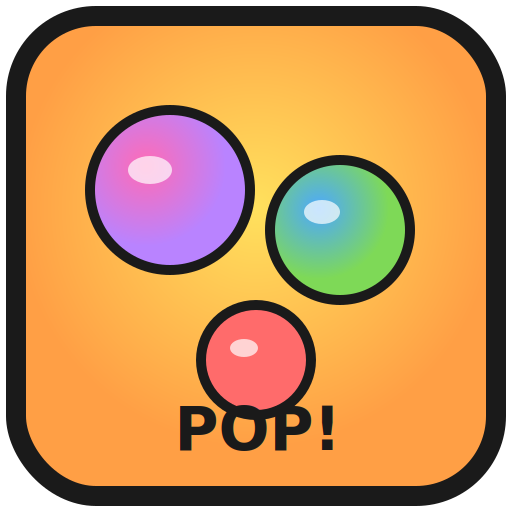

# 🫧 Bubble Pop! — A Neobrutalism Arcade

A bold, playful bubble shooter game built with vanilla JavaScript, Canvas, and a **Neobrutalism** design language. Thick borders, chunky shadows, vibrant flat colors, smooth animations, and zero frameworks in the runtime.



## ✨ Features

- 🎯 **Classic bubble shooter gameplay** — aim, shoot, match 3+
- 🏆 **20 levels** across Easy / Medium / Hard tiers with star ratings
- 💣 **3 power-ups** — Bomb 💣 (radius blast), Rainbow 🌈 (matches any), Lightning ⚡ (full column)
- 🎵 **Procedural audio** — all sounds generated via Web Audio API (no asset files needed)
- 📳 **Haptic feedback** — vibrate on mobile for every action
- 🎖 **16 achievements** + XP-based player leveling
- 📊 **Local leaderboard** with today / week / all-time filters
- 🔥 **Daily streak counter** — play every day for streak rewards
- 🎨 **Stunning UI** — bold borders, chunky shadows, spring animations
- 📱 **Fully responsive** — works on phones, tablets, desktops
- 🌐 **PWA** — installable, offline-capable
- 🚀 **Deployable** — Vercel/Netlify config included
- 📦 **Mobile app** — Capacitor wrap for iOS & Android

## 🎮 How to Play

1. Open the game (see "Running locally" below)
2. **Move mouse / finger** to aim — dashed line shows trajectory
3. **Click / Tap** to shoot
4. **Match 3+** same-color bubbles to pop them
5. **Match 4+** to earn a random power-up!
6. Clear the board to complete the level

## 🚀 Running Locally

### Quick start (no build)
Just open `index.html` in a browser. Works out of the box.

```bash
# or with a simple server:
npx serve .
```

### With Vite (hot reload, build optimization)
```bash
npm install
npm run dev          # dev server at http://localhost:3000
npm run build        # production build to dist/
npm run preview      # preview the production build
```

## 🌐 Deploy to Vercel

```bash
npm install -g vercel
vercel
```

Or one-click deploy: push to GitHub → import on [vercel.com](https://vercel.com). The included `vercel.json` handles rewrites and headers automatically.

## 📱 Build Mobile App (Capacitor)

```bash
npm install
npm run build
npx cap add android   # Android
npx cap add ios       # iOS (requires macOS)
npx cap sync
npx cap open android  # opens Android Studio
```

## 🎨 Design System — Neobrutalism

| Token | Value |
|-------|-------|
| Border | `4px solid #1A1A1A` |
| Shadow | `6px 6px 0 #1A1A1A` (offset, no blur) |
| Background | `#F5EFE0` (cream) |
| Accent | `#FFE15D` (yellow) |
| Typography | Bungee (display) + Press Start 2P (arcade) + Inter (body) |

Design philosophy: **bold, playful, accessible**. Every interactive element has a thick border, an offset shadow, and a satisfying hover lift animation.

## 📁 Project Structure

```
bubble-shooter/
├── index.html              # Main entry
├── manifest.json           # PWA manifest
├── sw.js                   # Service worker (offline)
├── package.json
├── vite.config.js
├── vercel.json             # Vercel deployment
├── capacitor.config.json   # Mobile wrap config
├── css/
│   ├── style.css           # Neobrutalism design system
│   ├── animations.css      # Keyframe library
│   └── responsive.css      # Breakpoints
├── js/
│   ├── storage.js          # Centralized localStorage wrapper
│   ├── audio.js            # Web Audio procedural sounds
│   ├── particles.js        # Canvas particle system
│   ├── levels.js           # 20 level configs
│   ├── powerups.js         # Bomb/Rainbow/Lightning
│   ├── achievements.js     # 16 badges + XP system
│   ├── leaderboard.js      # Local top scores
│   ├── ui.js               # Onboarding, modals, toasts
│   └── game.js             # Core canvas engine
└── assets/
    └── icons/              # PWA icons
```

## ⌨️ Controls

| Action | Desktop | Mobile |
|--------|---------|--------|
| Aim | Move mouse | Drag finger |
| Shoot | Click / Space | Tap |
| Pause | ESC or ⏸ button | Pause button |
| Navigate menus | Mouse / Tab | Tap |
| Power-up | Click dock button | Tap dock button |

## 🎯 Tech Stack

- **HTML5 Canvas** — game rendering
- **Vanilla JavaScript (ES6+)** — no framework, no runtime deps
- **CSS3** — custom properties, keyframes, grid/flex
- **Web Audio API** — procedural sound effects
- **Service Worker** — PWA offline support
- **Vite** — build tool (optional, dev only)
- **Capacitor** — mobile wrap (optional)

## 📊 Performance Targets

- ✅ 60 FPS with 50+ bubbles on screen
- ✅ < 500KB gzipped initial load
- ✅ Lighthouse: 90+ Performance, 95+ Accessibility
- ✅ Works offline after first visit (PWA)

## 🤝 Credits

Built with ❤️ using vanilla web technologies. No frameworks, no build pipeline required for the core game.

---

**Enjoy popping those bubbles! 🫧💥**